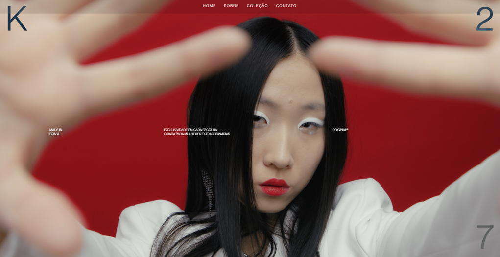

# K27 - Website de Moda de Luxo



Este site foi desenvolvido para uma marca de moda focada em roupas femininas exclusivas e sofisticadas. O objetivo do site é proporcionar uma experiência elegante e envolvente, refletindo a dedicação da marca à qualidade e ao design atemporal.

## Visão Geral do Projeto

O site de moda **K27** foi projetado para oferecer uma experiência de usuário moderna e sofisticada. Com um design minimalista e animações dinâmicas, ele visa cativar os visitantes desde a primeira interação. As principais seções incluem:

- **Home:** Um fundo de vídeo em tela cheia apresentando as modelos da marca, com impacto visual marcante.
- **Sobre:** Informações sobre a história da marca, visão e compromisso com a moda de luxo.
- **Coleção:** Exposição das últimas peças de moda, com um layout moderno que enfatiza a exclusividade e a elegância.
- **Contato:** Uma página simples para que clientes potenciais possam entrar em contato com a marca.

## Tecnologias Utilizadas

- **HTML5** para estruturar o conteúdo.
- **CSS3** para a estilização, com foco em layouts modernos e responsivos.
- **GSAP (GreenSock Animation Platform):** Para animações e transições suaves.
- **JavaScript:** Usado para elementos interativos, reprodução automática de vídeos e comportamento do menu de navegação.
- **Google Fonts:** O site usa as fontes `PP Neue Montreal` e `Poppins` para um visual limpo e sofisticado.

## Funcionalidades

### 1. Fundo de Vídeo em Tela Cheia
A página inicial apresenta um vídeo em tela cheia que reproduz automaticamente ao carregar, criando uma atmosfera envolvente e luxuosa. O vídeo destaca elementos-chave do estilo da marca, com uma tipografia impactante que reforça a exclusividade dos produtos.

### 2. Menu de Navegação Animado
A barra de navegação permanece oculta no carregamento inicial e aparece suavemente após um atraso de 5 segundos, cronometrada para melhorar a experiência visual. O efeito hover em cada item do menu é animado com o GSAP, criando uma interação elegante quando o usuário passa o mouse sobre as opções.

### 3. Blocos e Letras Interativos
A página inicial inclui uma animação sofisticada das letras (K27), adicionando um toque moderno. Esse design visual é reforçado por blocos criativos que se movem pela tela, intensificando a sensação de luxo.

### 4. Layout Limpo e Responsivo
O site é totalmente responsivo, garantindo que tenha uma ótima aparência tanto em dispositivos desktop quanto móveis. Com media queries e elementos de design flexíveis, a experiência do usuário permanece consistente em diferentes tamanhos de tela.


Para rodar este projeto localmente:

1. Clone o repositório:
   ```bash
  
   git clone https://github.com/seunomeusuario/K27-fashion-website.git

